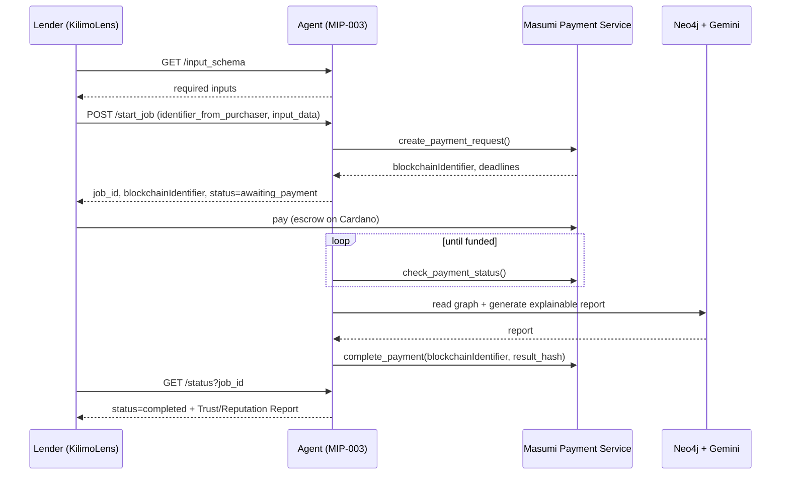

# KilimoLens Masumi Agents

Two **independent, Masumi-discoverable AI services**. They are **not part of
KilimoLens** — they are reusable agents that *any* lender (SACCO, MFI, bank) can
discover via the Masumi registry, pay through the Masumi Payment Service, and call
over the standard **MIP-003 Agentic Service API**. KilimoLens is simply one
consumer that discovers and hires them.

| Agent | Port | What it sells |
|-------|------|---------------|
| **Farmer Trust Agent** | 8100 | A portable, explainable **Farmer Trust Report** (trust score, identity confidence, repayment behaviour, fraud flags, timeline) |
| **Cooperative Intelligence Agent** | 8200 | An explainable **Cooperative Reputation Report** (reputation, default risk, financial stability, climate exposure) |

> **Why these agents?** Today every lender re-verifies the same farmer or
> cooperative from zero. These agents maintain *portable* intelligence so the work
> is done once and sold on demand — exactly the kind of reusable service Masumi's
> agent economy is built for. **Every report explains *why*, never just a number.**

---

## Architecture

```
                 Masumi Registry  ◄── agents register & publish capabilities
                       ▲
                       │ discover
   ┌───────────────────┴───────────────────┐
   │            Lender (e.g. KilimoLens)     │
   └───────────────────┬───────────────────┘
        MIP-003 calls   │   pay via Masumi Payment Service (escrow on Cardano)
                        ▼
   ┌─────────────────────────┐     ┌─────────────────────────────┐
   │   Farmer Trust Agent     │     │ Cooperative Intelligence Ag. │
   │   (FastAPI, MIP-003)     │     │   (FastAPI, MIP-003)         │
   │   /availability          │     │   /availability              │
   │   /input_schema          │     │   /input_schema              │
   │   /start_job  /status    │     │   /start_job  /status        │
   │   /provide_input /audit   │     │   /provide_input /audit      │
   └───────────┬─────────────┘     └───────────────┬─────────────┘
               │   shared infra (common/)           │
               ▼                                    ▼
        Payment provider (Masumi SDK | mock)  ·  Neo4j (read-only)  ·  Gemini (explainability)
```

Each agent only **executes the job after payment is confirmed**, then writes the
result hash back to settle the escrow. A per-job **audit trail** records every
step.

---

## Folder structure

```
masumi-agents/
├── common/                     # shared infra (both agents are independent deploys)
│   ├── config.py               # settings (payment, neo4j, gemini)
│   ├── mip003.py               # MIP-003 request/response models
│   ├── payment.py              # Masumi SDK provider + offline mock provider
│   ├── jobs.py                 # MIP-003 job lifecycle + audit trail
│   ├── graphdb.py              # read-only Neo4j access
│   └── llm.py                  # Gemini explanations (with deterministic fallback)
├── farmer_trust_agent/
│   ├── main.py                 # MIP-003 FastAPI app  (port 8100)
│   ├── agent.py                # trust-report logic
│   └── schemas.py
├── cooperative_intelligence_agent/
│   ├── main.py                 # MIP-003 FastAPI app  (port 8200)
│   ├── agent.py                # reputation-report logic
│   └── schemas.py
├── requirements.txt
└── .env.example
```

---

## MIP-003 endpoints (both agents)

| Method | Path | Purpose |
|--------|------|---------|
| GET  | `/availability` | Is the agent up (`available`/`unavailable`) |
| GET  | `/input_schema` | The inputs `/start_job` expects |
| POST | `/start_job` | Start a job → returns `job_id` + payment binding (`blockchainIdentifier`) |
| GET  | `/status?job_id=` | Poll status (`awaiting_payment`→`running`→`completed`) + result |
| POST | `/provide_input` | Supply extra input (not needed here; all input is upfront) |
| GET  | `/audit/{job_id}` | Per-job audit trail (Masumi auditability) |

---

## Masumi integration points

- **Registration / discovery** — each agent has its own `*_AGENT_IDENTIFIER` and
  `*_SELLER_VKEY`, registered on Masumi; consumers find it in the registry and
  read `/input_schema` to learn how to call it.
- **Payment** — `common/payment.py` wraps the `masumi` SDK (`Config`, `Payment`):
  `create_payment_request()` on `/start_job`, then the job manager polls
  `check_payment_status()` and only runs once funded, finally `complete_payment()`
  with the SHA-256 result hash. With no key configured it falls back to an
  in-memory **mock** that simulates the same lifecycle (offline demos).
- **Audit trail** — every job records `job_created → payment_requested →
  payment_confirmed → execution_started → execution_completed → payment_settled`.

---

## Sequence diagram



---

## Example — Farmer Trust Agent

**Request**
```bash
curl -X POST http://localhost:8100/start_job -H "Content-Type: application/json" -d '{
  "identifier_from_purchaser": "kilimolens-001",
  "input_data": { "national_id": "77001122", "phone_number": "+254712345678" }
}'
# -> { "job_id": "...", "blockchainIdentifier": "...", "status": "awaiting_payment", "amountLovelace": 2000000 }
```

**Result (GET /status once completed) — real output:**
```json
{
  "farmerId": "F0993cde5c2d7",
  "trustScore": 85,
  "identityConfidence": 90,
  "verificationStatus": "Verified",
  "repaymentBehaviourSummary": "Repayment behaviour is strong (score 1.00). 1 assessment on record; 1 approved, 0 declined.",
  "knownFraudFlags": [],
  "historicalTimeline": [
    {"date": "2026-06-26", "event": "Credit assessment", "detail": "readiness 98, Approve (Approved), Fertilizer"}
  ],
  "confidenceLevel": "Medium",
  "recommendations": ["Eligible for streamlined approval - strong, verified trust profile."],
  "explanation": "This farmer presents a strong trust score of 85/100, supported by a perfect 1.00 repayment history and a high identity confidence of 90, which is fully verified. The absence of any fraud flags, coupled with active memberships in Nakuru Highlands Coop and Rift SACCO, further reinforces this positive profile.",
  "dataSources": ["KilimoLens Knowledge Graph (Neo4j)"],
  "generatedBy": "Farmer Trust Agent (Masumi)"
}
```

## Example — Cooperative Intelligence Agent

**Request**
```bash
curl -X POST http://localhost:8200/start_job -H "Content-Type: application/json" -d '{
  "identifier_from_purchaser": "kilimolens-coop-1",
  "input_data": { "cooperative_name": "Nakuru Highlands", "county": "Nakuru" }
}'
```

**Result — real output:**
```json
{
  "cooperativeName": "Nakuru Highlands Coop",
  "county": "Nakuru",
  "reputationScore": 66,
  "activeMembership": 2,
  "averageRepaymentBehaviour": 0.75,
  "averageDefaultRisk": 6,
  "climateExposure": "Moderate",
  "financialStabilityIndicators": {"memberCount": 2, "averageReadiness": 94, "approvalRate": 100.0, "declinedMembers": 0},
  "strengths": ["Strong average member repayment behaviour"],
  "weaknesses": ["Thin membership data - limited statistical confidence"],
  "recommendations": ["Suitable for cooperative-level credit lines with standard monitoring."],
  "explanation": "The Nakuru Highlands Coop received a reputation score of 66/100 ... a 100% approval rate, no fraud reports, and high average member readiness of 94 ... default risk is very low at 6/100 ...",
  "dataSources": ["KilimoLens Knowledge Graph (Neo4j)"],
  "generatedBy": "Cooperative Intelligence Agent (Masumi)"
}
```

---

## Run locally

```bash
cd masumi-agents
python -m venv .venv && .\.venv\Scripts\activate        # (or source .venv/bin/activate)
pip install -r requirements.txt
copy .env.example .env                                  # fill in Neo4j + Gemini; leave PAYMENT_API_KEY blank for mock

# two terminals (independent services):
uvicorn farmer_trust_agent.main:app --port 8100
uvicorn cooperative_intelligence_agent.main:app --port 8200
```

- **Mock payment mode** (no `PAYMENT_API_KEY`): the full MIP-003 flow runs offline;
  payment auto-confirms after ~2s so you can demo end-to-end.
- **Production**: set `PAYMENT_SERVICE_URL`, `PAYMENT_API_KEY`, the per-agent
  `*_AGENT_IDENTIFIER` / `*_SELLER_VKEY`, and `NETWORK` — the agents then require
  real on-chain payment before returning a report.

> Docs: Masumi MIP-003 — https://docs.masumi.network/mips/_mip-003
